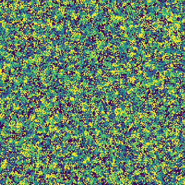

This library simulates [cyclic cellular automata](https://en.wikipedia.org/wiki/Cyclic_cellular_automaton)
with the common parametrization: range, threshold, number of states and neighbourhood type (Moore or Neumann).   

   
Install with 

```
python3 setup.py build_ext --inplace
```

Its quite slow right now, which I plan to improve upon soon.

```
 python cca.py --hood neumann --range 3 --num_frames 30 --threshold 4 --width 200 --height 200 --num_frames 400
```

